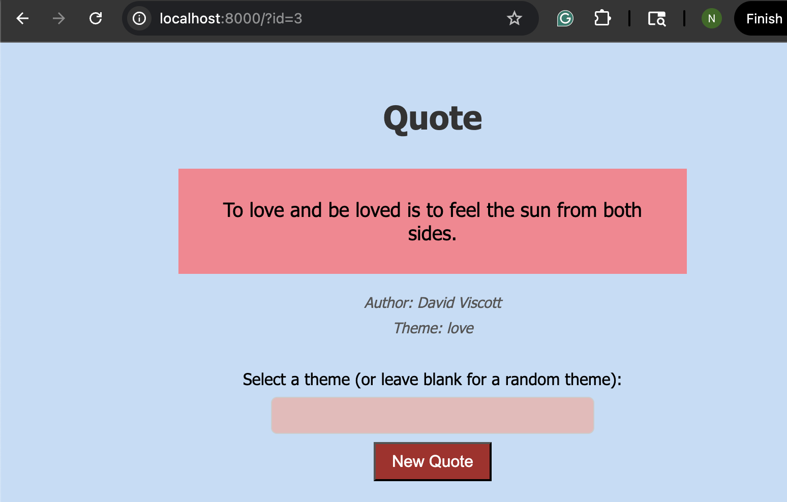

### Author: Nathan Metens
### Professor: Bart Massey

# Quote Server

This repo is a learning experience. 

In the Rust Web Dev class taught by Bart Massey, I follow along with his knock-knock
server on GitHub to learn full-stack web development in Rust.

This server shows random famous quotes about love, marriage, life, and stoicism.
These quotes are randomly chosen from a JSON file that was generated by AI each time
the client refreshes the page. 

The methods in this server are asynchronous, so that multiple
Users can access them simultaneously and view different quotes.

## Quote Server demonstration:

Before:

After: 

## API Server Endpoints

To get a random quote from the backend server:
- http://127.0.0.1:8000/api/v1/random-quote

To fetch a quote by its id:
- http://127.0.0.1:8000/api/v1/quote/{quote-id}

To fetch a quote by a certain theme (love, live, marriage, stoicism, motivation, i love you):
- http://127.0.0.1:8000/api/v1/tagged-quote?tags={theme}

## Check Port Usage

I frequently ran into an issue when re-compiling my code after edits. The issue was that
I got a panick because the "Address was already in use". To check this, I ran the following
command in the terminal `lsof -i :<PORT>` and if that port had a running instance, I used
`kill <PID>` to terminate its instance and then recompiled with the run script: `./run.sh`.

## Problems With Super Secret Key

I tried for a while to take a step by step approach to implementing the JWT Auth,
but each time I added some things to the code, the server would not serve the back-end as
it just had moments ago. This was because I didn't have a super-secret key yet, so the jwt
wasn't working properly. Here is what I did to fix this issue:
`mkdir secrets`
`echo "super-secret-key" > secrets/jwt_secret.txt`
`openssl rand -base64 32 > secrets/jwt_secret.txt`

I created a dir called secrets and added a "super-secret-key". I used openssl to create
a random secret key that i put in the jwt_secret.txt file to solve the issue I was having.

## Resources

- The [random number](https://rust-random.github.io/book/guide-values.html).
- The JSON file with random quotes about love, marriage, death, stoicism, and life
were generated using [ChatGPT](https://chatgpt.com/)

- [Iterators](https://doc.rust-lang.org/std/iter/trait.Iterator.html)
- [Axum Tutorial](https://www.shuttle.dev/blog/2023/12/06/using-axum-rust)
- [Rust Docs for Axum](https://docs.rs/axum/latest/axum/)
- Bart Massey's [GitHub](https://github.com/pdx-cs-rust-web/knock-knock)
- [Examples](https://users.rust-lang.org/t/run-examples-in-subfolders-using-cargo/18154/3) because I needed to test small sections of the program that wasn't working
